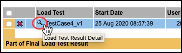
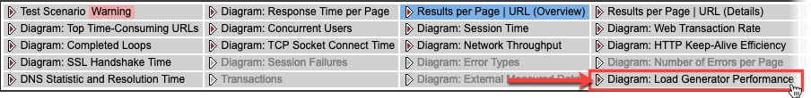
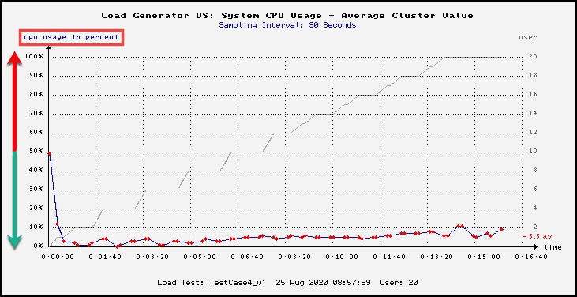
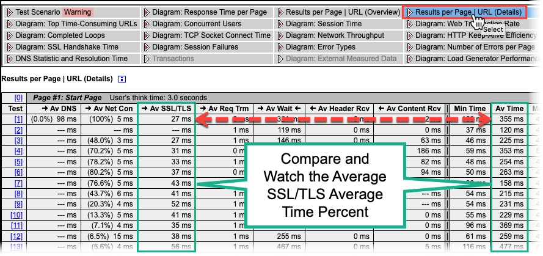

# ALT OnDemand Agents Guide

## Introduction 

This Guide describes how the OnDemand Agents work for Apica LoadTest (ALT) and tips not to overload them.

The typical subscription for an ALT customer is “OnDemand.”

## Locations 

| **Location Map**                                                                                                         | **OnDemand Agent Locations**                                       |
| ------------------------------------------------------------------------------------------------------------------------ | ------------------------------------------------------------------ |
| 
When you set up a load test, you choose from a set of locations from where you want to run your load test:

 | 
Each location has several available OnDemand Agents.

 |

## OnDemand Agents 

On the following link, you can find up-to-date information about locations and agents:

[ALT Agent Global Locations with IPs](https://apica-ip-addresses.s3.eu-central-1.amazonaws.com/alt-agent-networks.html)

The current number of available agents per location:

| Location            | Available agents |
| ------------------- | ---------------- |
| Australia - Sydney  | 10               |
| Brazil - Sao Paolo  | 10               |
| Canada - Montreal   | 10               |
| Germany - Frankfurt | 10               |
| France - Paris      | 50               |
| Ireland - Dublin    | 10               |
| India - Mumbai      | 10               |
| Japan - Tokyo       | 40               |
| South Korea - Seoul | 10               |
| Sweden - Stockholm  | 50               |
| Singapore           | 10               |
| UK - London         | 10               |
| USA - Ohio          | 250              |
| USA - Oregon        | 250              |
| USA - San Francisco | 250              |
| USA - Washington DC | 250              |
|                     |                  |
| **Total Agents**    | **1220**         |

## How Customer Jobs are Allocated 

Each OnDemand Agent has a limit of 500-1,000 Virtual Users, depending on the location and contract.

When a customer runs a load test job, one or more agents are:

* Reserved for that customer only
  * For each location
  * For the duration of the job
  * For a maximum of 500 Virtual Users (VU) per Agent
* The allocation takes place before the jobs start.
* These agents are not available for any other customers or jobs for the duration of the test.

### Example: 

A customer wants to run a load test of 1,800 VU’s from 2 locations. The system will then allocate 2 agents in each location, and each agent will run 450 VU’s.

When using Performance Test Scenarios and several tests, each test/Job is handled separately.

## Performance of a Load test Agent 

As before, each Agent is allocated up to 500 VU’s, but the CPU load on the Agents can vary a lot depending on the script:

Each of these conditions calls for More/Higher CPUs:

* The number of calls per “page.”
  * _**Higher calls**_
* If calls are made in “parallel” or “serial.”
  * _**Parallel Calls**_
* The think time (pause) between each “page.”
  * _**Shorter Think Times**_
* The response times of the called resources
  * _**Shorter Response Time**_

When an Agent is overloaded (e.g., CPU > 90%), it will limit the throughput, and the returned performance data will be wrong (too low).

In general, an Agent can handle up to 1,000 calls per second.

## Can you see if an Agent is overloaded? 

### 1. Compare Response Times 

####  Loop Time > Page Times = Agent Overload 

The typical symptom of an overloaded Agent is that the total duration of a test iteration (“loop time”) is clearly longer than the sum of the “page times.”

This is because _not all execution time is included in the page times_. For instance, _SSL handshakes_, _HTTP handshakes_, and _garbage collection_.

* _When the Agent's CPU is overused, these additional processes may take significant time for the agent to process so that they will be added to the Loop time but NOT the Page Time._

### Example: 

| 
On the test “Overview” tab, check the

<em>Average Response time Per Loop</em>
 | 
Compare the Loop Response time to the

Page Summary Total
                                                                                                                           |
| ------------------------------------------------------------------------------------------ | ----------------------------------------------------------------------------------------------------------------------------------------------------------------------------------------------- |
| 

Note: Session Time included Think Times
                                      | 

There was no difference; the Loop included each of the 5-page response times, so the Agent worked fine!

If we saw Loop Response Time > Page Times, the Agent is overloaded.
 |

| <h3 id="altondemandagentsguide-lookingatthedetailedresultfile"><strong>Looking at the detailed result file</strong></h3>                                         |                                                                                                                                                                                              |
| ---------------------------------------------------------------------------------------------------------------------------------------------------------------- | -------------------------------------------------------------------------------------------------------------------------------------------------------------------------------------------- |
| Once a job is finished, you can download the detailed result file and analyze it. In the “Jobs” view, click the download icon for the job you’re interested in.  |                                                                                                                                                                                              |
| 
This will get you an xxx.prxres file.

Put that file in the ZebraTester/MyTests folder.

Open the file in the ZebraTester UI/Project Navigator:
 |                                                                                                                                                                                              |
| Then click the magnifying glass next to the Load Test name:                                                                                                      |                                                                                                                                                      |
| Then select the _**Diagram: Load Generator Performance**_:                                                                                                       |                                                                                                                                                      |
| Finally, look at the **CPU Usage graph**:                                                                                                                        | 

In this example, the usage is very low, so we’re fine! 
 |

### 2. Leverage SSL Cache Efficiencies 

####  More SSL Cache Hits Help Agent CPU 

| <h3 id="altondemandagentsguide-checksslcacheefficiencyandpercenttimespentonssl"><strong>Check SSL Cache Efficiency and Percent time Spent on SSL.</strong></h3>                                                                                                                                                                             |                                          |
| ------------------------------------------------------------------------------------------------------------------------------------------------------------------------------------------------------------------------------------------------------------------------------------------------------------------------------------------- | ---------------------------------------- |
| You can check for this in the result file (see the previous section) by selecting _**Diagram: SSL Cache Efficiency**_. The example below shows that a new SSL handshake was performed for every request. This can be CPU intensive, so keep the SSL Cache-hits as high as possible; Offloading this to the cache keeps the Agent CPU lower. |                                          |
| Also, look at the _**Results per Page \| URL (Details)**_ view. Compare the numbers in the **Av SSL/TLS** column with the **Av Time** column. In the example below, about 10% of the time is spent on SSL.                                                                                                                                  |  |

## Tips to Avoid Overloading Agents 

1. _**Use longer think time between pages.**_
2. _**Use more locations.**_
   1. _**This will spread the load over several Agents.**_
3. _**Re-use the SSL connections as much as possible.**_
