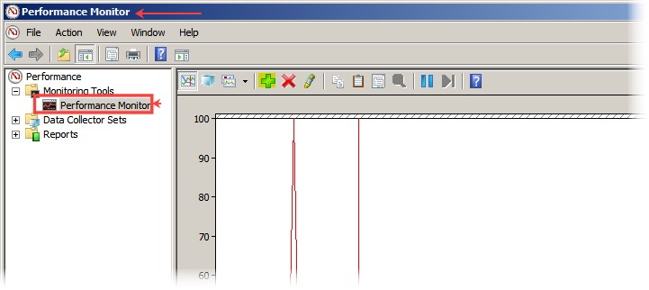
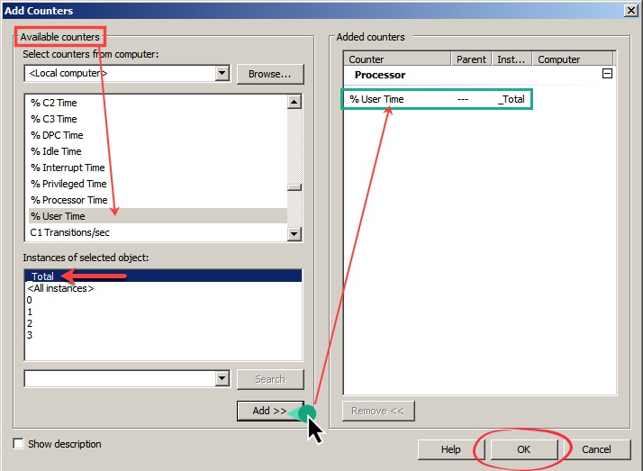
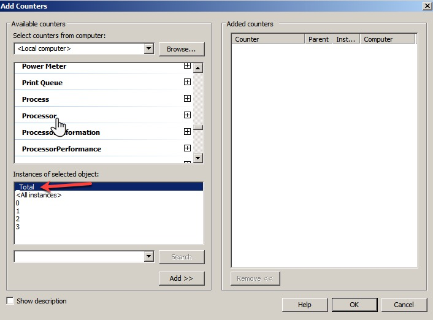
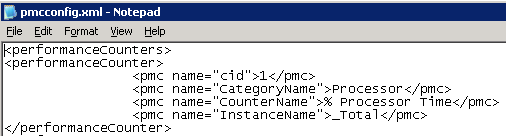

# Apica PMA Counters Summary

## Introduction 

This document specifies how to define Performance Counters for collection by the [Performance Monitoring Agent](https://apica-kb.atlassian.net/wiki/pages/createpage.action?spaceKey=GLOS\&title=Performance%20Agent) (PMA) in Windows, and the pre-defined performance counters that exist in the Apica LoadTest database.

The table shows the Counter ID (CID) and the Name (string) which will be shown when picking counters to show in the loadtest result.

Some of the counters apply to Windows in general or IIS or SQL Server specifically, others refer to Linux systems.

## Windows - Configure performance counters 

The _pmcConfig_ file describes the performance counters that will be collected by the agent.\
There are two templates available, to copy the configuration

* One for a typical IIS server
* One for a typical SQL server

#### pmcConfig File Example: 

Instruct the agent to collect the performance counter '_% Processor Time_' in the performance object '_Processor_', and we want to collect statistics for all processors so we set the instance to '\_Total'. The XML would look like this:\
`<performanceCounter>`\
`<pmc name="cid">1</pmc>`\
`<pmc name="CategoryName">Processor</pmc>`\
`<pmc name="CounterName">% Processor Time</pmc>`\
`<pmc name="InstanceName">_Total</pmc>`\
`</performanceCounter>`

### Manually getting Counter Data in Windows 

|                                                                                                                                                                                                                                                                                                                                                                                                                                                                                                                                                                                                                                                                                                                                                |                                             |
| ---------------------------------------------------------------------------------------------------------------------------------------------------------------------------------------------------------------------------------------------------------------------------------------------------------------------------------------------------------------------------------------------------------------------------------------------------------------------------------------------------------------------------------------------------------------------------------------------------------------------------------------------------------------------------------------------------------------------------------------------- | ------------------------------------------- |
| The easiest way to find additional Performance Counters is to open _perfmon.exe_ on the local machine and add a new counter.                                                                                                                                                                                                                                                                                                                                                                                                                                                                                                                                                                                                                   |  |
| 
You will be presented with a list of Categories like ‘Processor’ or ‘Processor Information’ and within these categories, you will find different performance counters like ‘% User Time’ or ‘% Processor Time’.

In this case below we see ‘<em>%User Time</em>’ and we want to add all instances of this counter under the Performance Object, '<em>Processor</em>'
                                                                                                                                                                                                                                                                                                                                                               |  |
| Once you have added the counter to perfmon, the selected counters will be displayed at the bottom of the window.                                                                                                                                                                                                                                                                                                                                                                                                                                                                                                                                                                                                                               |  |
| 
The list of selected counters contains the information that needs to be supplied to the agent in the <em>pmcConfig</em> file.

Object = CategoryName, Counter = CounterName, Instance = InstanceName

Performance objects (other than the default counters, and those included in the templates) will not be stored unless the counter ID has already been defined in the database, if the agent connects to an on-premise controller, see the controller manual for further details. If the agent connects to the SAAS controller (ltagcontroller.apicasystem.com) please contact <a href="mailto:support@apica.io">support@apica.io</a> and make sure to include the names of the performance objects that you wish to add.
 |  |

## Pre-defined counters in the ALT DB 

The columns show which counters/definitions are included in the templates. Note that the "default" counters (Window/Linux) are always reported by the agent, even without templates.

| **CID** | **Name in DB**                                        | **PMA default Windows** | **IIS Server Template** | **SQL Server Template** | **PMA default Linux** |
| ------- | ----------------------------------------------------- | ----------------------- | ----------------------- | ----------------------- | --------------------- |
| 1       | CPU Usage %                                           | **✓**                   | **✓**                   | **✓**                   | **✓**                 |
| 2       | Physical Memory Used (MB)                             |                         |                         |                         | **✓**                 |
| 3       | Mbit/s Received (RX)                                  | **✓**                   |                         |                         | **✓**                 |
| 4       | Mbit/s Transmitted (TX)                               | **✓**                   |                         |                         | **✓**                 |
| 5       | MB/s Read                                             | **✓**                   |                         |                         | **✓**                 |
| 6       | MB/s Written                                          | **✓**                   |                         |                         | **✓**                 |
| 7       | MYSQL Threads Running                                 |                         |                         |                         |                       |
| 8       | MySQL Threads Connected                               |                         |                         |                         |                       |
| 9       | MySQL Queries                                         |                         |                         |                         |                       |
| 10      | MySQL Open Tables                                     |                         |                         |                         |                       |
| 11      | MySQL Table Locks Waited                              |                         |                         |                         |                       |
| 12      | MySQL Slow Queries                                    |                         |                         |                         |                       |
| 15      | Load Avg (1 Min)                                      |                         |                         |                         | **✓**                 |
| 16      | Load Avg (5 min)                                      |                         |                         |                         | **✓**                 |
| 17      | Load Avg (15 Min)                                     |                         |                         |                         | **✓**                 |
| 18      | Pages swapped into memory                             |                         |                         |                         | **✓**                 |
| 19      | Pages swapped out of memory                           |                         |                         |                         | **✓**                 |
| 20      | IO Wait %                                             |                         |                         |                         | **✓**                 |
| 21      | Memory Cache Used (MB)                                |                         |                         |                         | **✓**                 |
| 22      | Running Processes                                     |                         |                         |                         | **✓**                 |
| 23      | Physical Memory Available                             |                         | **✓**                   | **✓**                   | **✓**                 |
| 24      | Physical Disk: Avg Disk Queue Length                  |                         | **✓**                   | **✓**                   |                       |
| 25      | System: Threads                                       |                         | **✓**                   | **✓**                   |                       |
| 26      | System: Processor Queue Length                        |                         | **✓**                   | **✓**                   |                       |
| 27      | Memory: Pages/sec                                     |                         | **✓**                   | **✓**                   |                       |
| 28      | Physical Disk: % Disk Time                            |                         | **✓**                   | **✓**                   |                       |
| 29      | TIME\_WAIT Connections                                |                         |                         |                         |                       |
| 30      | Current Anonymous Users                               |                         |                         |                         |                       |
| 31      | Current Connections                                   |                         |                         |                         |                       |
| 32      | Connections To Mock                                   |                         |                         |                         |                       |
| 33      | Memory Used %                                         |                         |                         |                         |                       |
| 34      | EJABBERD Connected Users                              |                         |                         |                         |                       |
| 35      | EJABBERD Outgoing s2s Con                             |                         |                         |                         |                       |
| 36      | EJABBERD Incoming s2s Con                             |                         |                         |                         |                       |
| 37      | REDIS: Ops per second                                 |                         |                         |                         |                       |
| 38      | IOSTAT A\_WAIT                                        |                         |                         |                         |                       |
| 42      | Threads                                               |                         |                         |                         |                       |
| 43      | System: Processor Queue Length                        |                         |                         |                         |                       |
| 44      | ESTABLISHED Connections                               |                         |                         |                         |                       |
| 45      | Web Service - Current Connections                     |                         | **✓**                   |                         |                       |
| 46      | Requests Current                                      |                         | **✓**                   |                         |                       |
| 47      | Requests/Sec                                          |                         | **✓**                   |                         |                       |
| 48      | % Time in GC                                          |                         | **✓**                   |                         |                       |
| 49      | Apache Processes                                      |                         |                         |                         |                       |
| 50      | Apache Connections                                    |                         |                         |                         |                       |
| 51      | Stingray: Current Connections                         |                         |                         |                         |                       |
| 52      | Open Files                                            |                         |                         |                         |                       |
| 53      | Application Running                                   |                         | **✓**                   |                         |                       |
| 54      | Requests Disconnected                                 |                         | **✓**                   |                         |                       |
| 55      | Requests Queued                                       |                         | **✓**                   |                         |                       |
| 56      | Requests Rejected                                     |                         | **✓**                   |                         |                       |
| 57      | State Server Sessions Active                          |                         | **✓**                   |                         |                       |
| 58      | Worker Process Restarts                               |                         | **✓**                   |                         |                       |
| 59      | Worker Process Running                                |                         | **✓**                   |                         |                       |
| 60      | Cache Total Entries                                   |                         | **✓**                   |                         |                       |
| 61      | Cache Total Hit Ratio                                 |                         | **✓**                   |                         |                       |
| 62      | Cache Total Turnover Rate                             |                         | **✓**                   |                         |                       |
| 63      | Errors Total/Sec                                      |                         | **✓**                   |                         |                       |
| 64      | Output Cache Entries                                  |                         | **✓**                   |                         |                       |
| 65      | Output Cache Hit Ratio                                |                         | **✓**                   |                         |                       |
| 66      | Output Cache Turnover Rate                            |                         | **✓**                   |                         |                       |
| 67      | Sessions Active                                       |                         | **✓**                   |                         |                       |
| 68      | Transactions Pending                                  |                         | **✓**                   |                         |                       |
| 69      | Transactions/Sec                                      |                         | **✓**                   |                         |                       |
| 70      | SQL Server: Batch Requests/sec                        |                         |                         | **✓**                   |                       |
| 71      | SQL Server: Buffer cache hit ratio                    |                         |                         | **✓**                   |                       |
| 72      | SQL Server: Number of Deadlocks/sec                   |                         |                         | **✓**                   |                       |
| 73      | SQL Server: Full Scans/sec                            |                         |                         | **✓**                   |                       |
| 74      | SQL Server: Table Lock Escalations/sec                |                         |                         | **✓**                   |                       |
| 75      | SQL Server: Repl. Trans. Rate                         |                         |                         | **✓**                   |                       |
| 76      | SQLServer: Buffer Manager Page life expectancy        |                         |                         |                         |                       |
| 77      | SQLServer: SQL Statistics SQL Compilations/sec        |                         |                         |                         |                       |
| 78      | SQLServer: SQL Statistics SQL Re-Compilations/sec     |                         |                         |                         |                       |
| 79      | SQLServer: Cursor Manager by Type Cursor Requests/sec |                         |                         |                         |                       |
| 80      | service user opened files                             |                         |                         |                         |                       |
| 81      | established connections                               |                         |                         |                         |                       |
| 82      | current threads                                       |                         |                         |                         |                       |
| 83      | webserver running processes                           |                         |                         |                         |                       |
| 84      | webserver status busy workers                         |                         |                         |                         |                       |
| 85      | webserver status idle workers                         |                         |                         |                         |                       |
| 86      | webserver status request x second                     |                         |                         |                         |                       |
| 87      | CPU Steal %                                           |                         |                         |                         |                       |
| 90      | ruleFirings-FeatureEventRule                          |                         |                         |                         |                       |
| 91      | ruleFirings-LASEFeatureAlertRule                      |                         |                         |                         |                       |
| 92      | ruleFirings-SaveWeatherDataEvent                      |                         |                         |                         |                       |
| 93      | ruleFirings-WeatherEventRule                          |                         |                         |                         |                       |
| 94      | ruleFirings-TimeTickRule                              |                         |                         |                         |                       |
| 95      | smsEmailWindPrecipNotifications-SMTPChannel           |                         |                         |                         |                       |
| 96      | smsEmailWindPrecipNotifications-SMSChannel            |                         |                         |                         |                       |
| 97      | smsEmailWindPrecipNotifications-LASEChannel           |                         |                         |                         |                       |
| 98      | smsEmailLightningNotifications-SMTPChannel            |                         |                         |                         |                       |
| 99      | smsEmailLightningNotifications-SMSChannel             |                         |                         |                         |                       |
| 100     | smsEmailLightningNotifications-LASEChannel            |                         |                         |                         |                       |
| 101     | laseLightningNotifications-SMTPChannel                |                         |                         |                         |                       |
| 102     | laseLightningNotifications-SMSChannel                 |                         |                         |                         |                       |
| 103     | laseLightningNotifications-LASEChannel                |                         |                         |                         |                       |
| 104     | lightningEvents                                       |                         |                         |                         |                       |
| 105     | windMETAREvents                                       |                         |                         |                         |                       |
| 106     | windTAFEvents                                         |                         |                         |                         |                       |
| 107     | precipMETAREvents                                     |                         |                         |                         |                       |
| 108     | precipTAFEvents                                       |                         |                         |                         |                       |
| 109     | AverageNumberTasksPerJob                              |                         |                         |                         |                       |
| 110     | NumberOfTasksSchedulePerSecond                        |                         |                         |                         |                       |
| 111     | NumberOfTasksProcessedPerSecond                       |                         |                         |                         |                       |
| 112     | InMemoryJobs                                          |                         |                         |                         |                       |

\
