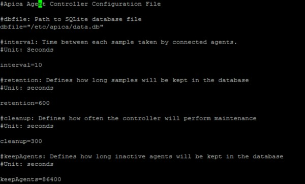
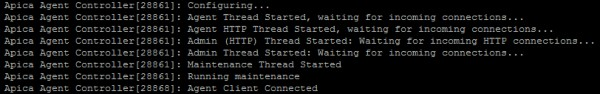

# Controller Installation

#### Controller <a href="#controllerinstallation-controller" id="controllerinstallation-controller"></a>

Apica Agent Controller is a service that listens for incoming connections from ApicaAgent clients. The agent controller collects performance metrics from connected clients and stores these values in a local database.

**Installation**

The installation package is a tar archive containing an installation script that places the necessary files in default locations on the local system. The binary file is located at `/etc/init.d/`.

* Extract the files from `install_apicacontroller.tar.gz`.


* Enter the directory `install_apicacontroller.sh`


* Optional: Edit `/etc/apica/server.conf` (see configuration)



* Start the controller by running `/etc/init.d/apica-agent-controller start`

The controller spawns a number of threads that listens on the following ports:

* `26301` (agent http clients),
* `26300` (agent plain tcp clients),
* `26400` (admin plain tcp clients),
* `26401` (admin http clients)
* Stop the controller by running `/etc/init.d/apica-agent-controller stop`

**Configuration**

| Item       | Description                                                                                                                                                                                                            |
| ---------- | ---------------------------------------------------------------------------------------------------------------------------------------------------------------------------------------------------------------------- |
| license    | Your license key.                                                                                                                                                                                                      |
| dbfile     | The path to the SQLite database file.                                                                                                                                                                                  |
| interval   | Sampling interval, defines the interval between samples gathered by agent clients.                                                                                                                                     |
| retention  | The time (in seconds) that samples are kept in the database. default value is `3600` (1 hour).                                                                                                                         |
| cleanup    | The controller spawns a maintenance thread that removes old samples and inactive agents regularly, the cleanup value defines the time (in seconds) between these maintenance runs. default value is `300` (5 minutes). |
| keepAgents | The time (in seconds) that inactive agent definitions are kept in the database. default value is `86400` (24 hours).                                                                                                   |

**Troubleshooting**

Logs: The agent logs to syslog on the local machine.



Connectivity issues: Clients must be able to connect to the agent controller machine on port `26300` (plain tcp) or `26301` (http).

The agent controller also provides some functions that enable clients to fetch performance values stored by the controller. Commands are sent as HTTP POST requests to the controller host on TCP port `26401`.

**Get directory of measurements**

This function returns all currently connected agents and their supported performance counters. Each object in the _measurements_ array contains the ID (`agent_id`) and the hostname of the agent, the id (`measurement_id`) of the performance counter as well as the name and unit.

**JSON Input**

```
{ "cmd": "getDirectory" }
```

**JSON Output**

```
{
"measurements": [
    { "agent_id": 2234 , "measurement_id": 2 , "hostname": "web1-xl", "measurement_name": "CPU Usage", "unit": "%" },
    { "agent_id": 2234 , "measurement_id": 3 , "hostname": "web1-xl", "measurement_name": "Memory Usage", "unit": "MB" },
    { "agent_id": 2234 , "measurement_id": 4 , "hostname": "web1-xl", "measurement_name": "Disk utilization", "unit": "%" },
    { "agent_id": 2221 , "measurement_id": 2 , "hostname": "web2-xl", "measurement_name": "CPU Usage", "unit": "%" },
    { "agent_id": 2221 , "measurement_id": 3 , "hostname": "web2-xl", "measurement_name": "Memory Usage", "unit": "MB" },
    { "agent_id": 2221 , "measurement_id": 4 , "hostname": "web2-xl", "measurement_name": "Disk utilization", "unit": "%" }
    ]
}
```

**Get values for time range**

This function returns all samples collected within a specified time range by a selected number of agents. The input expected is a time range and an array of objects where each object contains the ID of an agent (`agent_id`) and an array of identifiers for performance counters (`measurement_id`). the output is an array of objects where each object contains the id of the agent (`agent_id`), the id of the performance counter (`measurement_id`), and an array of objects where each object contains the value of the sample and a unix timestamp in UTC.

**JSON Input**

```
{
    "cmd": "getValues",
    "start_utc": 123123123123,
    "end_utc": 123123123123,
    "samples" : [
        {
        "agent_id": 2234 ,
        "measurement_id": [3,2]
        }
    ]
}
```

**JSON Output**

```
{
    "samples" : [
        {
                "agent_id" : 2234,
                "measurement_id" : 3, "values": [
            {
                "value" : 10,
                "timestamp_utc": 123123123123
            },
            {
                "value" : 12,
                "timestamp_utc": 123123123123
            }
        ]
    },
    {
        "agent_id" : 2234,
        "measurement_id" : 2, "values": [
    {
        "value" : 10,
        "timestamp_utc": 123123123123
    },
    {
        "value" : 12,
        "timestamp_utc": 123123123123
    },
    ]
    }
    ]
}
```

**Get All Counters**

This function returns the definitions for all performance counters. The output is an array of objects where each object contains the ID of the performance counter, the name and the unit.

**JSON Input**

```
{ "cmd" : "getAllCounters" }
```

**JSON Output**

```
{
    "measurements": [
        {
            "id": 1,
            "name": "CPU Usage",
            "unit": "%"
        },
        {
            "id": 2,
            "name": "Physical Memory Used", "unit": "MB"
        }
    ]
}
```

Insert Counter

This function creates a new definition for a performance counter in the database. The input expected is the ID of the performance counter (`counter`), the name and the unit. The function returns OK if successful.

**JSON Input**

```
{ "cmd" : "insertCounter", "counter" : 333, "name" : "Test", "unit" : "count" }
```

**JSON Output**

```
{"status": "OK"}
```

Update Counter

This function updates the definition of a performance counter stored in the database. The input expected is the ID of the performance counter (`counter`), the name and the unit.

**JSON Input**

```
{ "cmd" : "updateCounter", "counter" : 333, "name" : "Test1", "unit" : "count" }
```

**JSON Output**

```
{ "status" : "OK" }
```

Remove Counter

This function removes the definition of a performance counter stored in the database. The input expected is the ID of the performance counter (`counter`).

**JSON Input**

```
{ "cmd" : "removeCounter", "counter" : 333 }
```

**JSON Output**

```
{ "status": "OK" }
```

Get groups

This function returns all groups that are stored in the database. The output is an array of objects where each object contains the ID of the group, the name and an associated icon.

**JSON Input**

```
{ "cmd" : "getGroups" }
```

**JSON Output**

```
{
    "groups": [
        {
            "id": 5,
            "name": "Web",
            "icon": "server.png"
        }
    ]
}
```

New Group

This function inserts a new group into the database. The input expected is the name of the group and an associated icon. The function returns OK if successful.

**JSON Input**

```
{ "cmd" : "newGroup", "name" : "Test", "icon" : "server.png" }
```

**JSON Output**

```
{ "status" : "OK" }
```

Get group values

This function returns the current average for a group and a selected number of performance counters. The input expected is the ID of the group (`gid`) and an array of identifiers for performance counters (`measurement_id`) .the output is an array of objects where each object contains the id of the performance counter (`cid`), the current unix timestamp in utc and the average value across all selected agents (`total`).

**JSON Input**

```
{ "cmd" : "getGroupValues", "gid" : 5, "measurement_id" : [1,2] }
```

**JSON Output**

```
{
    "totalAgents": 2, "samples": [
        {
            "cid": 1,
            "timestamp_utc": 1380387406,
            "total": 1
        },
        {
            "cid": 2,
            "timestamp_utc": 1380387406,
            "total": 1232
        }
    ]
}
```

Remove Group

This function removes a group stored in the database. The input expected is the ID of the group (`gid`). The function returns OK if successful.

**JSON Input**

```
{ "cmd" : "removeGroup", "gid" : 6 }
```

**JSON Output**

```
{ "status" : "OK" }
```

Add To Group

This function associates an agent with a group. The input expected is the ID of the agent (`agent_id`) and the id of the group (`gid`). The function returns `OK` if successful.

**JSON Input**

```
{ "cmd" : "addToGroup", "agent_id" : 1968, "gid": 5 }
```

**JSON Output**

```
{ "status" : "OK" }
```

Reset Group

This function removes an agent from a group. The input expected is the ID of the agent (\{{agent\_id). The function returns \}}OK\` if successful.

**JSON Input**

```
{ "cmd" : "resetGroup", "agent_id" : 1968 }
```

**JSON Output**

```
{ "status" : "OK" }
```
