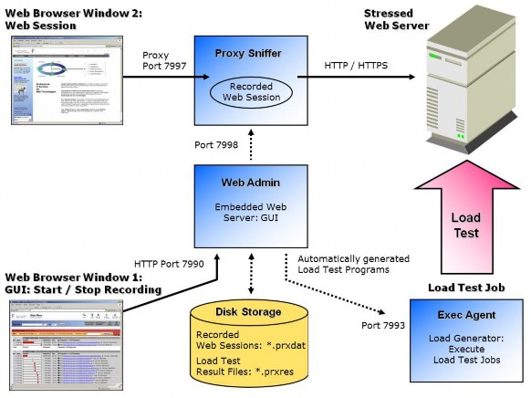

# Private Executing Agent Architecture

ZebraTester contains four built-in server components which are started on your local computer:

* Proxy Sniffer: A special proxy server used to record Web surfing sessions.
* Web Admin: An embedded, local Web server for the GUI.
* Exec Agent: A server which supports the execution of load test jobs.
* Job Controller: A server which allows to combine several load-releasing machines into a cluster.

The following TCP/IP server ports have been set up on your local system:

| Port Number       | Port Description                              |
| ----------------- | --------------------------------------------- |
| 7990              | Embedded Web Server, GUI (web admin)          |
| 7993              | Load Test Execution Server (exec agent)       |
| 7995              | Load Test Cluster Controller (job controller) |
| 7996 (optional)   | REST API Server (proxy sniffer)               |
| 7998              | Internal communication port (proxy sniffer)   |
| 7997              | HTTP/S Proxy Port (proxy sniffer)             |
| 7999 (deprecated) | HTTP Proxy Port, HTTP only (proxy sniffer)    |

Note: The **ZebraTester Console** application execute all of these four server components as integrated threads.

**Distributed Architecture**

Remote execution of load tests, as well as combining several Exec Agents (load generators) to a load generating cluster, is supported in an easy and transparent way.

On remote systems normally only Exec Agent are installed and started. They are normally running on port 7993 when plain TCP/IP connections are used or on Port 80 or 443 when HTTP/S connections are used for the internal ZebraTester communication between your local system and the remote Exec Agents – but any other TCP/IP port can also be configured. Please note that you have to enable the corresponding inbound firewall rule on the remote systems.

## Load Generators 

A Load Generator / Exec Agent is started on your local system as part of the ZebraTester Console. If you have additional agents on remote systems, these can be configured in the Project Navigator.

**Overview**

Additional Exec Agents – which run on remote systems – can be defined in the **Exec Agent Network Configuration** menu, which is reachable from Main Menu > Project Navigator > Network:

Additional Exec Agents which are running in your local network can be added in the lower part of the window.

Optionally, **pre-installed Exec Agents which are running in the Amazon Cloud** can be added by clicking on the EC2 icon in the upper right corner of the window. Such Exec Agents can be instantly rented per hour, or can be accessed by purchasing an "Unlimited Exec Agent Weekly License".

Several Exec Agents can be combined to a load-generating cluster. This can be done by using the **Exec Agent Clusters** dialogue at the right side of the window.

The operating system of the machines in a load-generating cluster (the cluster members) cans also be heterogeneous; that is, Windows and Unix-like systems, as well as strong and weak systems, can be mixed within the same cluster. The individual cluster members can be placed in different locations, and can also use different protocols to communicate with the Web Admin GUI.

The communication between the Web Admin GUI and the remote Exec Agent processes usually uses raw TCP/IP network connections to port 7993; however, this port number can be freely chosen if an Exec Agent process is installed separately. The communication can also be made over HTTP or HTTPS connections (tunneling), and also supports outbound HTTP/S proxy servers. The support of outbound

HTTP/S proxy server means, in this case, that load tests can be started from a protected corporate network and then transmitted, over the proxy server of the corporation, to any load releasing systems on the internet – all without the need for ordering new firewall rules.

Hint: you can test the configuration and the accessibility of an Exec Agent by clicking on the icon within the list of Exec Agents (functional “ping” of the exec agent).
