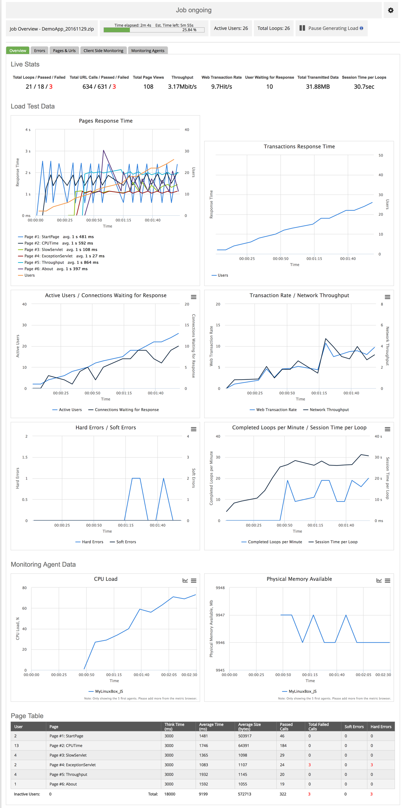
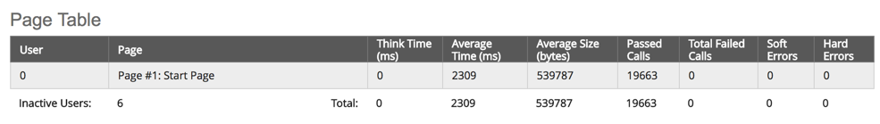
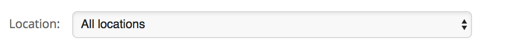

# View Test Runs in Real Time Using Live View

The **Live View** is accessible for running jobs. It provides real-time information about running tests and allows users to make adjustments to tests as they run.

## Access Live View 

Live Data is available from any running job by using the **Live Data** action.

**Show Live Data**

To show the Live Data for a running job:

* Start in the **Jobs** view.
* Find the running job in the **Running Jobs** section.

* Click the **Live View** action button.

The[ Live View](broken-reference) opens.

## Ramping 

During load tests using Ramp-Up/Ramp-Down, the Live view displays the ramps status. You can choose to abort the ramp process and have the test continue at the current load level, to avoid overloading.

**Limitations**

**Note:** Using the live ramp-up control feature requires that any ZebraTester scripts used are compiled with [ZebraTester version 5.5F or later](http://kb.apicasystem.com/display/PRX/ZebraTester+Download).

**View**

## Live Ramp Introduction 

The Ramping feature allows you to control Ramp-Up/Ramp-Down during a load test.

**Benefits**

One of the most common tasks in performance testing is to find an application's maximum throughput for a specific use case. The goal is to increase the load until the response time starts to fluctuate and the throughput flattens out. At this point increasing the load will not give more throughput just more fluctuations and increase of response time.

When a test is running with a ramp-up/ramp-down of the number of virtual users, this maximum maximum throughput point might occur while the test is still ramping up. This would mean that any further increase of load would only overload the system, and you would possibly not detect the correct throughput point.

In this situation, you would benefit from having the option of interrupting the ramp-up and continue at the same level to detect the maximum point.

**Feature**

Working in the Live View, you an use the "abort ramp"

 feature to manually abort the ramp-up/ramp-down of Virtual User at a specific level during a running test. This means that the load is capped at this level.

You can then change runtime settings to modify the load generation values during the test, and resume the ramp-up or ramp-down according to these new settings.

**Note:** The abort operation is not allowed when load generation is paused or while the test is resuming .

**Process**

The workflow for interrupting ramping is as follows:

* View the current ramping Status
* Abort Ramping the ramping
* Pause Load load generation
* Runtime Settings according to your needs
* Pause Load load generation

## Status 

While a test using ramp-up/ramp-down is running, the current status for the ramp process is displayed at the top of the Live View.

## Abort Ramping 

When the **Abort** button is available, you can interrupt the currently running ramp-up/ramp-down.

**View**

Number of users in the test can be changed only when generating load is going.

If you decrease the number of users to zero then the load test job will stop as soon as zero users are reached. Only already running users can be decreased.

If you trigger an increase or a decrease during an already existing increasing/decreasing process then a second increasing/decreasing process will run in parallel.

Note: Starting from version 5.5f, changing the number of users is not allowed when there is an ongoing ramp-up/down in progress and also during resuming generating load.

To change the number of users during ramp-up/down process first click "Abort ramp-up/down" button and wait until abort operation is finished.

## Pause Load 

The **Pause Load** button lets you temporarily pause loadtest traffic and set user count to `0`.

While load generation is paused, the test will continue to run with 0 users until load generation is resumed.

To Pause load generation:

* Click **Pause Load**

To Resume load generation:

* Click **Resume Load**

## Runtime Settings 

While a job is running, you can access the **Runtime Settings** and change them on the fly.

| Setting       | Description                                              | Comment                                                       |                                                                                                              |
| ------------- | -------------------------------------------------------- | ------------------------------------------------------------- | ------------------------------------------------------------------------------------------------------------ |
|               | Users                                                    | Number of virtual users.                                      | You can only decrease existing users. Decreasing users to zero will stop the job when zero users is reached. |
| Startup Delay | Time for Ramp-Up to use when increasing number of users. | Applied when increasing user count after a previous decrease. |                                                                                                              |
| Duration      | Load test job duration.                                  |                                                               |                                                                                                              |

**Note:** If you add a change while a previous change is still running, the processes will run in parallel.

**Note:** Depending on whether ramping is aborted or not, and whether load generation is paused or not, some of these settings may not be availabel to change.

**User Input**

When scripts used in the load test contain User Input Fields, these can also be updated in real time.

## Change Settings 

You can change the Runtime Settings for any job that is currently running.

**Change Runtime Settings**

* Start with a running job.

* Click the **Change Runtime Settings** button

The **Real Time Settings** dialog opens.

* Change settings as needed
* Click **Update Job Settings**

**Note**: If you set the user count or duration lower than the original setting, the job will end prematurely.

## Pages & URLs 

In the **Pages & URLs** tab you can find detailed information about the page calls in the load test.

## Location Filter 

The tables can be filtered by location.

* Open the **Locations** dropdown menu
* Select the location to display

## Page & URL Table 

For each page, a table displays the returned components.

| Icon                 | Description                                                                                                                     |               |
| -------------------- | ------------------------------------------------------------------------------------------------------------------------------- | ------------- |
|                      |  Expand                                                                                                                         | Show details. |
| #                    | Order in the page sequence.                                                                                                     |               |
| URL                  | [HTTP Method](https://apica-kb.atlassian.net/wiki/spaces/ALTDOCS/pages/5672816/HTTP+Methods) and URL associated with the error. |               |
| Passed Calls         | Number of successful URL calls.                                                                                                 |               |
| Failed Calls         | Number of failed URL calls.                                                                                                     |               |
| Min/Max Respose Time | Lowest and highest response times.                                                                                              |               |
| Avg. Response Time   | Average response time.                                                                                                          |               |
| Soft Errors          | Number of [soft errors](https://apica-kb.atlassian.net/wiki/spaces/ALTDOCS/pages/5673388/Soft+Errors).                          |               |
| Hard Errors          | Number of [hard errors](https://apica-kb.atlassian.net/wiki/spaces/ALTDOCS/pages/5672807/Hard+Errors).                          |               |
| Size                 | Message size.                                                                                                                   |               |

## Page & URL Details 

Each row in the table can be expanded to display detailed information about the response times for the component.

### Show Details 

To show the component details:

* Click  **Expand** to show response time information.

The charts are displayed:

#### URL Response Time Over Time 

As the name indicates, the **URL Response Time Over Time** chart displays a graph of the response times for the component over the duration of the test.

#### Average Response Time 

In the **Average Response Time** chart, the times for applicable parts of the process are displayed, together with a combined average sum.

### Hide Details 

To hide the component details:

* Click the  **Collapse**

## Monitoring Agents 

The **Monitoring Agents** tab presents additional metrics from the Performance Agent. The agent overview shows all involved agents (on multiple pages if necessary), with aggregated data.

| Column                    | Description                                      |
| ------------------------- | ------------------------------------------------ |
| Monitoring Agent          | Agent name/identifier and network address.       |
| CPU Usage %               | Percentage of CPU used.                          |
| Physical Memory Available | Available memory.                                |
| Memory Page/s             | Memory pages per second swapped to or from disk. |
| Mbit/s Transmitted        | Outgoing traffic volume.                         |
| Mbit/s Received           | Incoming traffic volume.                         |
| Physical Disk Time        | Percentage of time spent reading/writing disks.  |

Refresh

The information is automatically updated at regular intervals.

To update the information manually:

* Click the **Refresh All** button

**Details**

You can select an individual agent and view detailed information about it.

* Open the **Agent** dropdown menu
* Select the agent from the list

The view is updated with information and charts relating to the selected agent.

## CPU 

In the **CPU Load** chart, information about processor usage is shown.

**View**

The chart indicates how much processing the agents are doing at various times, allowing you to identify possible bottlenecks.

**Options**

The  **chart options** allow you to use the metric browser to select which agents to display in the chart.

## Traffic 

In the **Mbit/s Transmitted / Mbit/s Received** chart, information about data traffic over the agent is shown.

**View**

| Data               | Description              |
| ------------------ | ------------------------ |
| Mbit/s Transmitted | Outgoing traffic volume. |
| Mbit/s Received    | Incoming traffic volume. |

**Options**

The  **chart options** allow you to use the metric browser to select which agents to display in the chart.

## Live Ad AppDynamics 

#### AppDynamics 

The **AppDynamics** tab shows charts for metrics collected through the AppDynamics link. You can Select Metrics for each graph while the test is running. The changed metrics can be saved in the load test Preset Preset.

## Application Infrastructure Performance 

| Icon | Action         | Description                                |   |
| ---- | -------------- | ------------------------------------------ | - |
| log  | Change Y-Axis  | Toggles the Y-Axis between Change Y-Scale. |   |
|      | Change Size    | Modify the chart Change Size.              |   |
|      | Chart Options  | Modify the AppDynamics Live Charts.        |   |
|      | Download Chart | Download the chart Download.               |   |

## Backends 

| Icon | Action         | Description                                |   |
| ---- | -------------- | ------------------------------------------ | - |
| log  | Change Y-Axis  | Toggles the Y-Axis between Change Y-Scale. |   |
|      | Change Size    | Modify the chart Change Size.              |   |
|      | Chart Options  | Modify the AppDynamics Live Charts.        |   |
|      | Download Chart | Download the chart Download.               |   |

## Business Transaction Performance 

| Icon | Action         | Description                                |   |
| ---- | -------------- | ------------------------------------------ | - |
| log  | Change Y-Axis  | Toggles the Y-Axis between Change Y-Scale. |   |
|      | Change Size    | Modify the chart Change Size.              |   |
|      | Chart Options  | Modify the AppDynamics Live Charts.        |   |
|      | Download Chart | Download the chart Download.               |   |

## End User Experience 

| Icon | Action         | Description                                |   |
| ---- | -------------- | ------------------------------------------ | - |
| log  | Change Y-Axis  | Toggles the Y-Axis between Change Y-Scale. |   |
|      | Change Size    | Modify the chart Change Size.              |   |
|      | Chart Options  | Modify the AppDynamics Live Charts.        |   |
|      | Download Chart | Download the chart Download.               |   |

## AppDynamics Errors 

| Icon | Action         | Description                                |   |
| ---- | -------------- | ------------------------------------------ | - |
| log  | Change Y-Axis  | Toggles the Y-Axis between Change Y-Scale. |   |
|      | Change Size    | Modify the chart Change Size.              |   |
|      | Chart Options  | Modify the AppDynamics Live Charts.        |   |
|      | Download Chart | Download the chart Download.               |   |

## Information Points 

| Icon | Action         | Description                                |   |
| ---- | -------------- | ------------------------------------------ | - |
| log  | Change Y-Axis  | Toggles the Y-Axis between Change Y-Scale. |   |
|      | Change Size    | Modify the chart Change Size.              |   |
|      | Chart Options  | Modify the AppDynamics Live Charts.        |   |
|      | Download Chart | Download the chart Download.               |   |

## Mobile 

| Icon | Action         | Description                                |   |
| ---- | -------------- | ------------------------------------------ | - |
| log  | Change Y-Axis  | Toggles the Y-Axis between Change Y-Scale. |   |
|      | Change Size    | Modify the chart Change Size.              |   |
|      | Chart Options  | Modify the AppDynamics Live Charts.        |   |
|      | Download Chart | Download the chart Download.               |   |

## Overall Application Performance 

| Icon | Action         | Description                                |   |
| ---- | -------------- | ------------------------------------------ | - |
| log  | Change Y-Axis  | Toggles the Y-Axis between Change Y-Scale. |   |
|      | Change Size    | Modify the chart Change Size.              |   |
|      | Chart Options  | Modify the AppDynamics Live Charts.        |   |
|      | Download Chart | Download the chart Download.               |   |

## Service Endpoints 

| Icon | Action         | Description                                |   |
| ---- | -------------- | ------------------------------------------ | - |
| log  | Change Y-Axis  | Toggles the Y-Axis between Change Y-Scale. |   |
|      | Change Size    | Modify the chart Change Size.              |   |
|      | Chart Options  | Modify the AppDynamics Live Charts.        |   |
|      | Download Chart | Download the chart Download.               |   |

## Select Metrics 

When viewing AppDynamics in the [Live Live View](https://apica-kb.atlassian.net/wiki/pages/createpage.action?spaceKey=ALTDOCS\&title=Live%20Live%20View\&linkCreation=true\&fromPageId=5673729) during a running load test, you can use the **chart options** button to change which metrics to include in the chart.

**View**

* Click the  **chart options** button

The currently used metrics are indicated in the tree:

* Select the metrics you want to use to the chart

* Click **Apply**

The metrics are added to the chart(s).

## Preset 

#### Preset 

If you change the displayed metrics for any of the chart, and want to reuse the same selection in future tests, you can save it to the loadtest preset.

**View**

At the bottom of the tab, there is a checkbox, **Save Selection of Metrics to Preset**:

Clicking the checkbox opens the **Preset** dialog:

The current preset, if any, is selected automatically.

* Select a preset from the dropdown menu
* Click **Update**

A notification is shown:

The selection is applied to the preset.
