# Understanding Loadtest Results

The **Results** view is accessible for completed jobs and provides access to all information collected during a test run. It also allows you to compare different instances with each other:

<figure>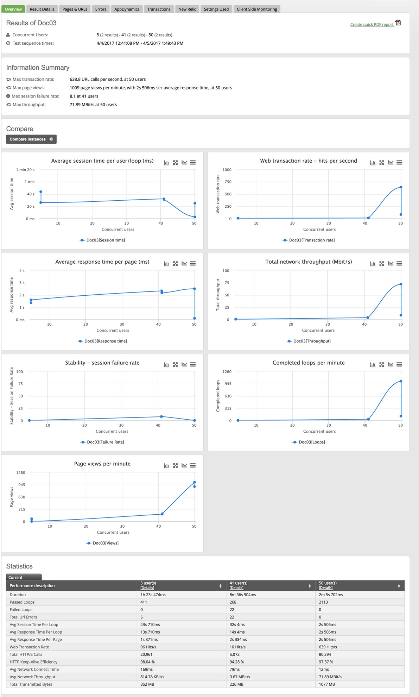<figcaption></figcaption></figure>

<figure>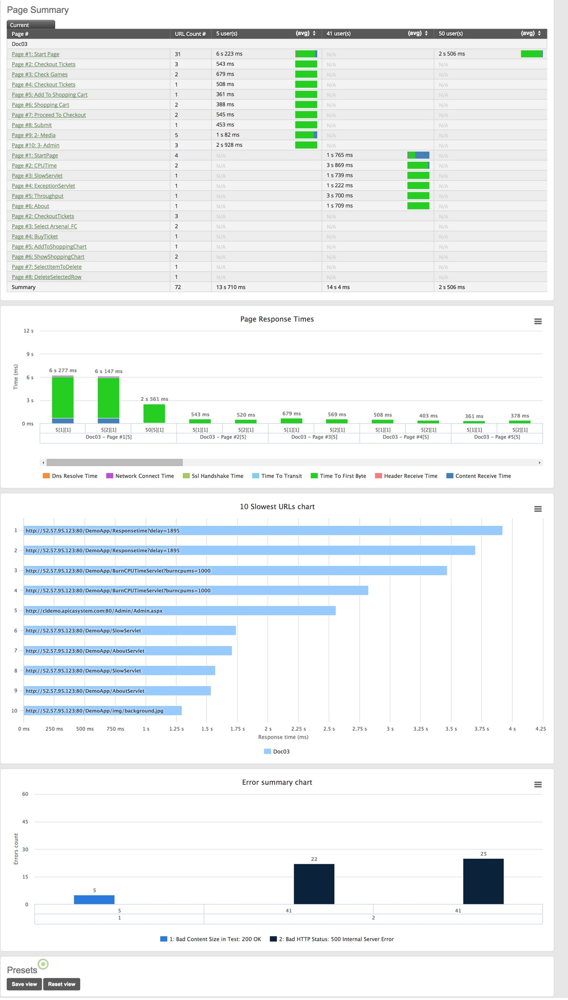<figcaption></figcaption></figure>

## Result Details 

The **Result Details** tab contains a number of charts which provide metrics related to the performance of the Load Test. It displays the metrics for a specific Test Result within the Test Instance you are viewing. It contains a header which displays the Concurrent Users which were specified when the test was configured. It also displays the start and end times of the Test. Select the Test Result to view by selecting a number of users from the “Users” dropdown; the metrics displayed on the charts are specific to the test run which was selected. The charts can be manipulated to show or hide additional data, printed, or expanded to provide a better view of the chart; see [Understanding Load Test Result Charts](broken-reference) for more details.

The following screenshot shows metrics for a Test Result which ran a .class file with 2 users (the .class file name has been obfuscated). Response times can be compared to the number of Active Users - virtual users who have started but not yet finished the Test.

<figure>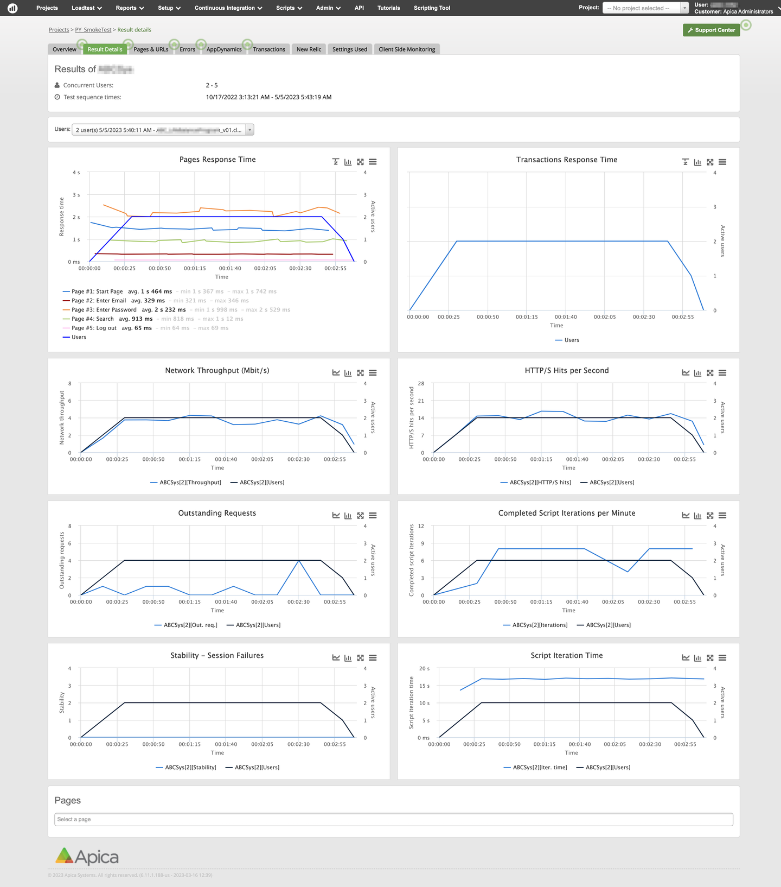<figcaption></figcaption></figure>

## Pages & URLs 

The **Pages & URLs** tab shows detailed data about URL and page response times, and provides access to response time breakdowns.

<figure>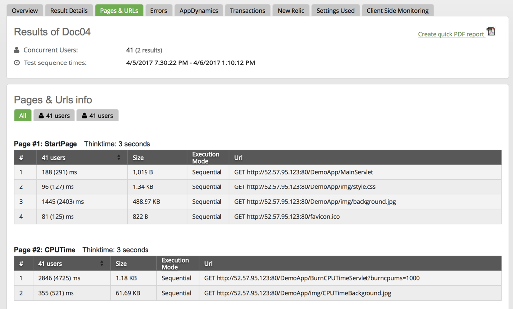<figcaption></figcaption></figure>

This page contains detailed results for each individual URL call in the test.&#x20;

### Instance 

The **Instance** section shows basic information about the test.

<figure><figcaption></figcaption></figure>

| Item                    | Description                                                                                                                                |
| ----------------------- | ------------------------------------------------------------------------------------------------------------------------------------------ |
|  Concurrent Users       | Number of [Users](https://apica-kb.atlassian.net/wiki/spaces/ASMDOCS/pages/4632035/Virtual+User).                                          |
|  Test Sequence Times    | Start and end for the test sequence run.                                                                                                   |
| Create Quick PDF Report | Button to [Quick Report](https://apica-kb.atlassian.net/wiki/pages/createpage.action?spaceKey=DMT\&title=Quick%20Report) form the results. |

### Results 

In the **Results** section you can select which run to display in the charts and tables. Each run in the instance is indicated by a tab showing the number of users.

<figure><figcaption></figcaption></figure>

By default, information about all runs is displayed:

<figure>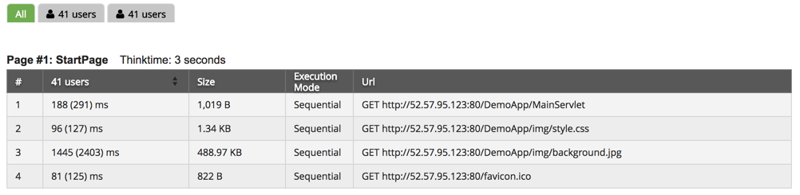<figcaption></figcaption></figure>

To select a specific run, click the tab with the desired number of users:

<figure><figcaption></figcaption></figure>

The table corresponding to the run is shown in the [Pages & Urls](https://apica-kb.atlassian.net/wiki/spaces/ALTDOCS/pages/5672450/Table) section.

## Errors 

Errors show detailed information about any possible errors if any have occurred.

<figure>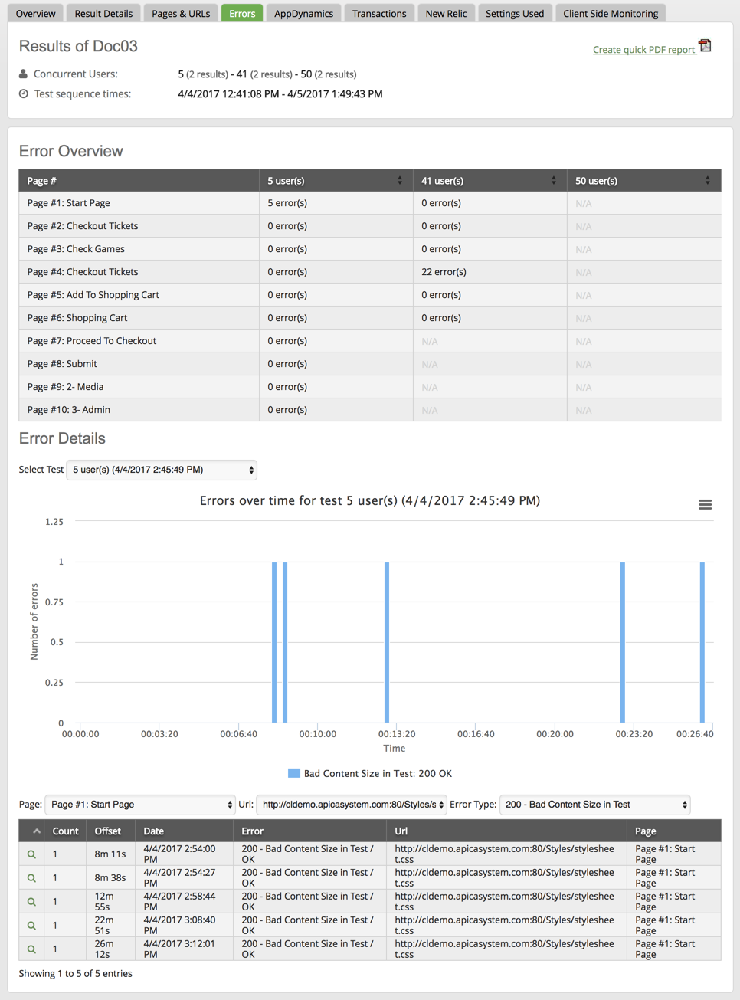<figcaption></figcaption></figure>

## Instance 

The **Instance** section shows basic information about the test.

<figure><figcaption></figcaption></figure>

| Item                    | Description                                                                                                                        |
| ----------------------- | ---------------------------------------------------------------------------------------------------------------------------------- |
|  Concurrent Users       | Number of [users](https://apica-kb.atlassian.net/wiki/spaces/ALTDOCS/pages/5672993/Virtual+User).                                  |
|  Test Sequence Times    | Start and end for the test sequence run.                                                                                           |
| Create Quick PDF Report | Button to [create a PDF report](https://apica-kb.atlassian.net/wiki/spaces/ALTDOCS/pages/5674012/QRQuick+Report) form the results. |

## Error Overview 

The **Error Overview** table shows the number of errors per page and test.

<figure>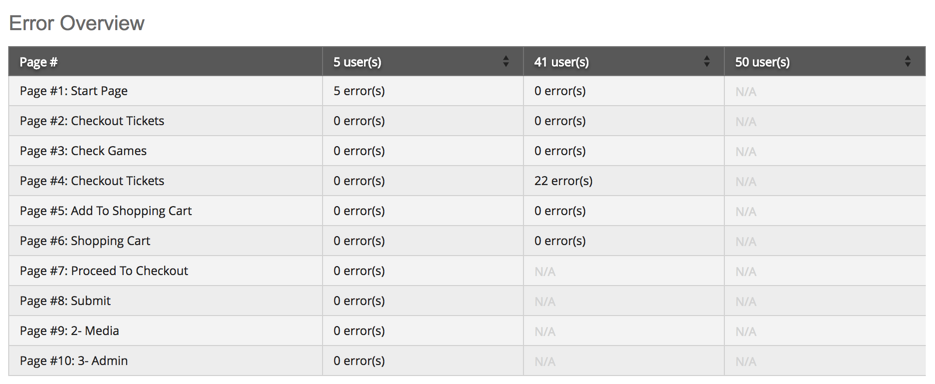<figcaption></figcaption></figure>

Each page is a row in the table, with a column for each test.

This view allows you to see which tests contain errors and select them for display in the details chart and table.

## Chart 

The **Errors Over Time** chart shows error occurrences during the test for the selected location.

<figure>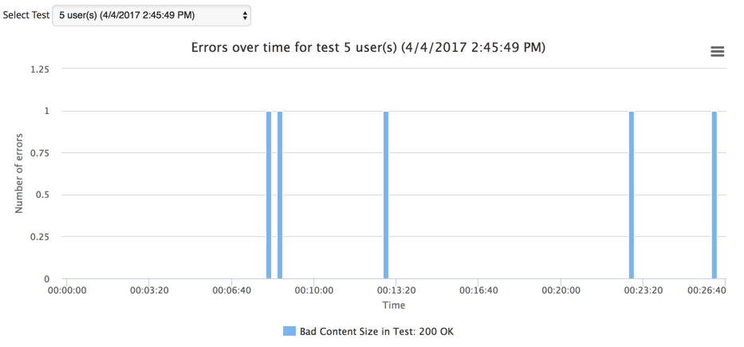<figcaption></figcaption></figure>

The chart shows the number of errors during the test for the selected test.

**Select Test**

To display the chart, you need to select the test in the dropdown menu.

<figure><figcaption></figcaption></figure>

## Live Error Feed 

The **Live Errors Feed** table shows information about the last recorded errors [chart](https://apica-kb.atlassian.net/wiki/spaces/ALTDOCS/pages/5672165/Chart).

<figure>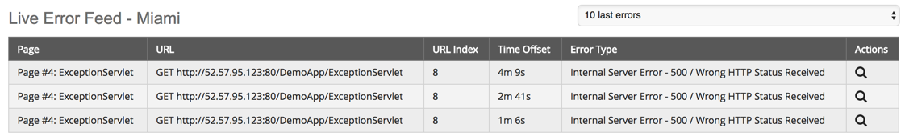<figcaption></figcaption></figure>

| Column      | Description                                                                                                                                            |
| ----------- | ------------------------------------------------------------------------------------------------------------------------------------------------------ |
| Page        | Page order number and name in scenario.                                                                                                                |
| URL         | [HTTP Methods](https://apica-kb.atlassian.net/wiki/pages/createpage.action?spaceKey=GLOS\&title=HTTP%20Methods) and URL associated with the error.     |
| URL Index   | Error number relative to the URL.                                                                                                                      |
| Time Offset | Time when the error occured, relative to the start of test.                                                                                            |
| Error Type  | [HTTP Status Codes](https://apica-kb.atlassian.net/wiki/pages/createpage.action?spaceKey=GLOS\&title=HTTP%20Status%20Codes) and message for the error. |
| Actions     | Buttons for possible actions to perform on the error.                                                                                                  |

**Actions**

| Column | Action  | Description                                                                                        |
| ------ | ------- | -------------------------------------------------------------------------------------------------- |
|        | Details | Open the [Error Details](https://apica-kb.atlassian.net/wiki/spaces/ALTDOCS/pages/5673614) dialog. |

## Error Details 

The **Error Details** dialog provides access to a number of tabs containing detailed information relating to the error.

<figure>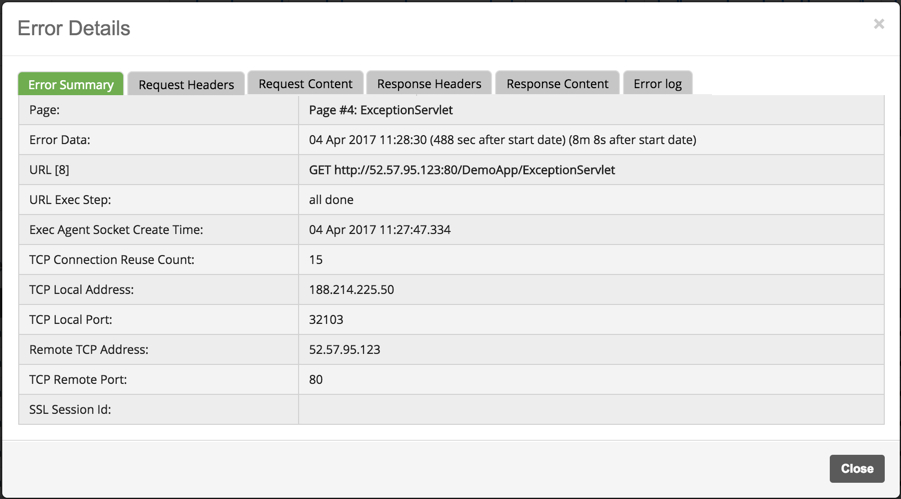<figcaption></figcaption></figure>

### Summary 

The **Summary** section shows the received content of the response.

<figure>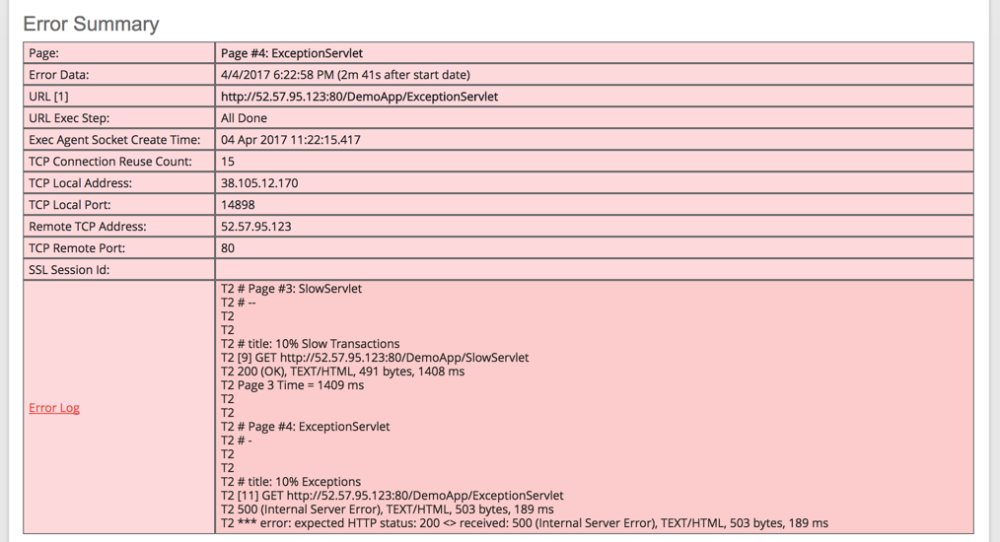<figcaption></figcaption></figure>

| Row                           | Description                                                                                                                     |
| ----------------------------- | ------------------------------------------------------------------------------------------------------------------------------- |
| Page                          | Page order number and name in scenario.                                                                                         |
| Error Data                    | Time when error occured: Timestamp, time after start (number of seconds, and converted time).                                   |
| URL                           | [HTTP Method](https://apica-kb.atlassian.net/wiki/spaces/ALTDOCS/pages/5672816/HTTP+Methods) and URL associated with the error. |
| URL Exec Step                 | Execution step when error occured.                                                                                              |
| Exec Agent Socket Create Time | Creation time for the execution agent connection.                                                                               |
| TCP Connection Reuse Count    | Number of reuses of the TCP connection.                                                                                         |
| TCP Local Address             | TCP local IP address.                                                                                                           |
| TCP Local Port                | Local port for TCP connection.                                                                                                  |
| Remote TCP Address            | TCP remote address.                                                                                                             |
| TCP Remote Port               | Remote port for TCP connection.                                                                                                 |
| SSL Session Id                | Session ID for [SSL](https://apica-kb.atlassian.net/wiki/spaces/ALTDOCS/pages/5673458/Ssl) connection.                          |
| Error Log                     | Scrollable log view. Clicking the header opens the full log in a separate browser window.                                       |

### Log 

The log in the [Summary](https://apica-kb.atlassian.net/wiki/spaces/ALTDOCS/pages/5672038/Summary) section can be viewed in a separate browser tab.

<figure>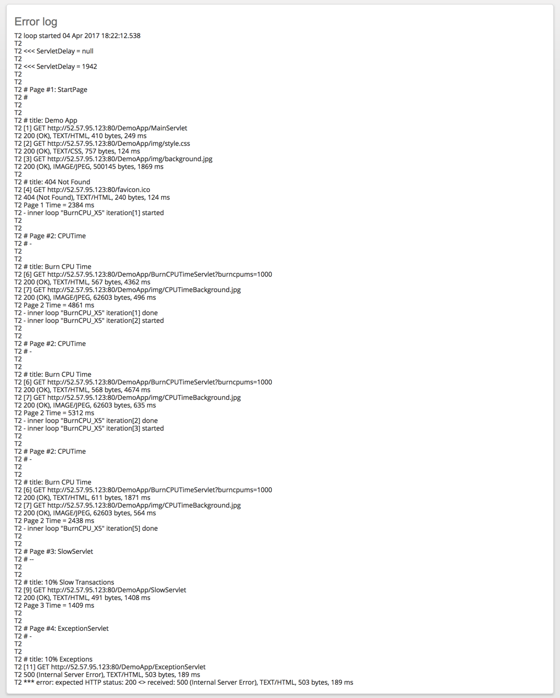<figcaption></figcaption></figure>

### Request 

In the **Request Headers** tab, information about the request preceding the error is displayed.

<figure>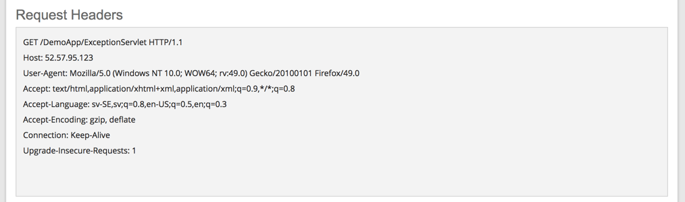<figcaption></figcaption></figure>

The table displays the [HTTP Methods](https://apica-kb.atlassian.net/wiki/pages/createpage.action?spaceKey=GLOS\&title=HTTP%20Methods) and URL associated with the error at the top. Following that is a table containing all headers sent with the request.

### Request Content 

The **Request Content** tab shows the sent content of the request if any exists.

<figure>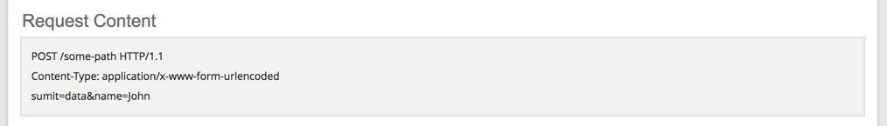<figcaption></figcaption></figure>

### Response Headers 

The **Response Headers** tab shows the received response headers.

<figure>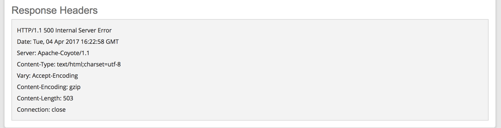<figcaption></figcaption></figure>

The table displays the [HTTP Status Codes](https://apica-kb.atlassian.net/wiki/pages/createpage.action?spaceKey=GLOS\&title=HTTP%20Status%20Codes) and text error at the top.

Following that is a table containing all headers provided in the response.

### Response Content 

The **Response Content** tab, shows the received content of the response, if any.

<figure>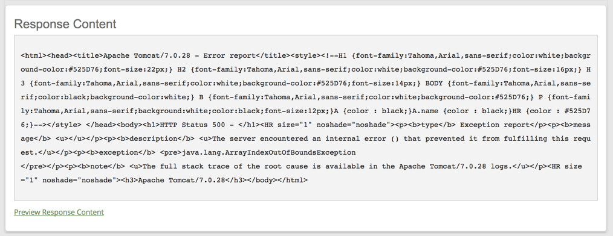<figcaption></figcaption></figure>

To view the content in a browser, click “Preview Response Content”. Your default browser opens to display the content:

<figure>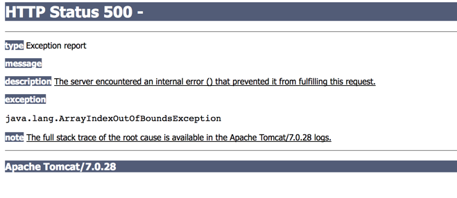<figcaption></figcaption></figure>

## Integrations 

Depending on which integrations you have enabled, various integration tabs may be available as part of the results view.

## Transactions 

The Transactions tab presents information about [User Defined Transactions](https://apica-kb.atlassian.net/wiki/spaces/ALTDOCS/pages/5673126/User-Defined+Transactions).

<figure><figcaption></figcaption></figure>

## Summary 

The **Transactions Summary** table shows an overview of the transactions for a selected result.

<figure>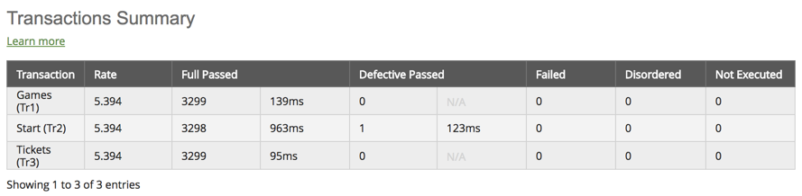<figcaption></figcaption></figure>

With the **All Transaction Times Percentile** chart, you get a _statistical_ view of how the transaction times are distributed.

<figure>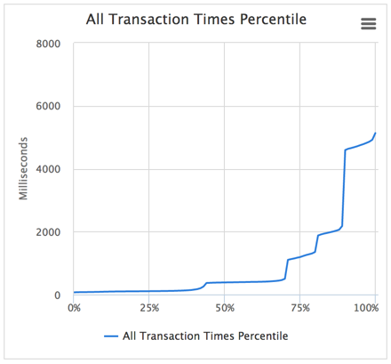<figcaption></figcaption></figure>

The **All Transaction Times** chart shows the transaction _times_ for the selected transaction.

<figure><figcaption></figcaption></figure>

In the **Full Passed Transaction Times Percentile** chart, you get a statistical view of how the transaction times are distributed for the passed transactions.

<figure><figcaption></figcaption></figure>

## Settings Used 

The **Settings Used** tab shows a summary of all settings used for a load test.

<figure><figcaption></figcaption></figure>

### Instance 

The **Instance** section shows basic information about the test.

| Concurrent Users            | Number of [Users](https://apica-kb.atlassian.net/wiki/spaces/ALTDOCS/pages/5672993/Virtual+User).                           |
| --------------------------- | --------------------------------------------------------------------------------------------------------------------------- |
| Test Sequence Times         | Start and end for the test sequence run.                                                                                    |
| **Create Quick PDF Report** | Button to the [Quick Report](https://apica-kb.atlassian.net/wiki/spaces/ALTDOCS/pages/5674012/QRQuick+Report) form results. |

### Results 

In the **Results** section, you can select which run to display.

To select a specific result set:

* Click the tab with the desired number of users

**The Settings Used tab shows a summary of all settings used for a load test.**

| **Item**                                     | **Description**                                                                                                                                                                                                |
| -------------------------------------------- | -------------------------------------------------------------------------------------------------------------------------------------------------------------------------------------------------------------- |
| **Scenario**                                 |                                                                                                                                                                                                                |
| Scenario                                     | Scenario used in the job.                                                                                                                                                                                      |
| **Loadtest Options**                         |                                                                                                                                                                                                                |
| Number of Concurrent Users                   | Number of [virtual users](https://apica-kb.atlassian.net/wiki/spaces/ALTDOCS/pages/5672993/Virtual+User) in the test.                                                                                          |
| Loadtest Duration                            | Total duration of the test.                                                                                                                                                                                    |
| Rampup Time                                  | Time to [ramp-up](https://apica-kb.atlassian.net/wiki/spaces/ALTDOCS/pages/5673372/Ramp-Up).                                                                                                                   |
| Run Multiple Sequential Tests                | Used [execution mode](https://apica-kb.atlassian.net/wiki/spaces/ALTDOCS/pages/5673008/Execution+Mode).                                                                                                        |
| **Location**                                 |                                                                                                                                                                                                                |
| Cluster                                      | Location [cluster(s) ](https://apica-kb.atlassian.net/wiki/spaces/ALTDOCS/pages/5673283/C+Cluster)used to generate load.                                                                                       |
| **Scenario Options**                         |                                                                                                                                                                                                                |
| User input Text Files                        | Connected [input file(s)](https://apica-kb.atlassian.net/wiki/spaces/ALTDOCS/pages/5672770/I+Input+Files).                                                                                                     |
| User Defined Vars                            | Variables defined in the scenario.                                                                                                                                                                             |
| **Advanced Options**                         |                                                                                                                                                                                                                |
| Max Loops Per User                           | Maximum number of [loops ](https://apica-kb.atlassian.net/wiki/spaces/ALTDOCS/pages/5673133/Load+Testing+Loop)per [users](https://apica-kb.atlassian.net/wiki/spaces/ALTDOCS/pages/5672993/Virtual+User).      |
| Request Timeout (sec)                        | Time to wait for responses.                                                                                                                                                                                    |
| Additional Options                           | Additional command line options provided as part of the job.                                                                                                                                                   |
| Distribute Load on All Available Datacenters | Enabled [load distribution](https://apica-kb.atlassian.net/wiki/spaces/ALTDOCS/pages/5673136/Load+Distribution)                                                                                                |
| **Client Options**                           |                                                                                                                                                                                                                |
| User Agent                                   | Client [User-Agent](https://apica-kb.atlassian.net/wiki/spaces/ALTDOCS/pages/5673101/User-Agent).                                                                                                              |
| **Network Bandwidth Downlink (Mbit/s):**     |                                                                                                                                                                                                                |
| Desktop                                      | Limit on downloaded desktop traffic.                                                                                                                                                                           |
| Mobile                                       | Limit on downloaded mobile traffic.                                                                                                                                                                            |
| **Network Bandwidth Uplink (Mbit/s):**       |                                                                                                                                                                                                                |
| Desktop                                      | Limit on uploaded desktop traffic.                                                                                                                                                                             |
| Mobile                                       | Limit on uploaded mobile traffic.                                                                                                                                                                              |
| Client Side Monitoring                       | Enabled [Client Side Monitoring](https://apica-kb.atlassian.net/wiki/spaces/ALTDOCS/pages/5673298/Client+Side+Monitor).                                                                                        |
| **DNS**                                      |                                                                                                                                                                                                                |
| DNS Hosts file                               | Custom [hosts file](https://apica-kb.atlassian.net/wiki/spaces/ALTDOCS/pages/5672827/HOSTS+File).                                                                                                              |
| DNS Server                                   | Custom [DNS server](https://apica-kb.atlassian.net/wiki/spaces/ALTDOCS/pages/5673215/DNS+Server) used for lookups.                                                                                             |
| Resolve DNS for Each Executed Loop           | Whether [DNS ](https://apica-kb.atlassian.net/wiki/spaces/ALTDOCS/pages/5673211/D+DNS)lookup is performed for each [loop](https://apica-kb.atlassian.net/wiki/spaces/ALTDOCS/pages/5673133/Load+Testing+Loop). |
| DNS Translation file                         | Custom [DNS server](https://apica-kb.atlassian.net/wiki/spaces/ALTDOCS/pages/5673215/DNS+Server) translation file used.                                                                                        |
| **Reporting**                                |                                                                                                                                                                                                                |
| Email Preliminary Report To                  | Address for test reports.                                                                                                                                                                                      |
| Reporting History                            | Limit on number of tests to include in test history.                                                                                                                                                           |
| **Execution**                                |                                                                                                                                                                                                                |
| Schedule                                     | Type of scheduling for the job.                                                                                                                                                                                |
| Schedule Date                                | Date for schedule.                                                                                                                                                                                             |
| **Test Information**                         |                                                                                                                                                                                                                |
| Attached to Project                          | Project the test belongs to.                                                                                                                                                                                   |
| Job Comment                                  | Comments added to the job settings.                                                                                                                                                                            |
| Tags                                         | Scenario Tags applied to the scenario.                                                                                                                                                                         |

&#x20;

## Client Side Monitoring 

If the job uses **Client Side Monitoring**, this tab shows real browser rendering times corresponding to the behavior of a real user accessing the application during the load test.

<figure><figcaption></figcaption></figure>

You will be able to see the total Response Time measured from a real browser for each separate run on this page.

## Instance Results 

The **Instance** section shows basic information about the test:

<figure>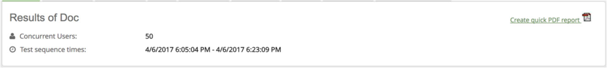<figcaption></figcaption></figure>

| **Item**                | **Description**                                                                                                                            |
| ----------------------- | ------------------------------------------------------------------------------------------------------------------------------------------ |
|  Concurrent Users       | Number of [Users](https://apica-kb.atlassian.net/wiki/spaces/ALTDOCS/pages/5672993/Virtual+User).                                          |
|  Test Sequence Times    | Start and end for the test sequence run.                                                                                                   |
| Create Quick PDF Report | Button to the [Quick Report](https://apica-kb.atlassian.net/wiki/pages/createpage.action?spaceKey=DMT\&title=Quick%20Report) form results. |

## Results 

In the **Results** section, you can select which run to display in the charts and tables.

<figure><figcaption></figcaption></figure>

To select a specific result set:

* Click the tab with the desired number of users

## Location Overview Chart 

For each location, a **Location Overview** chart displays a graph containing the page response times and the number of URL errors for all runs.

Select the desired location, e.g. Los Angeles, from the dropdown menu to pick which location to show in the chart.

<figure>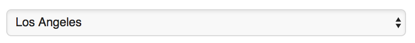<figcaption></figcaption></figure>

<figure>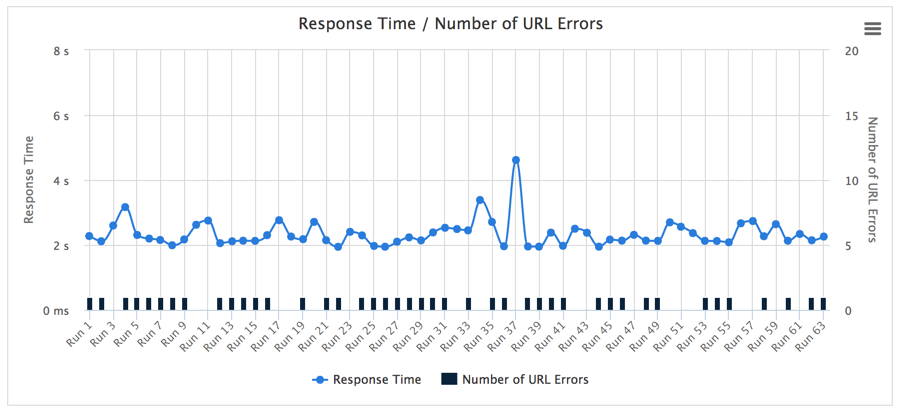<figcaption></figcaption></figure>

The chart shows the page response times and the number of URL errors overall runs for the selected location.

## Run Details 

The **Run Details** shows information about the run and provides access to related screenshots.

<figure><figcaption></figcaption></figure>

The run details contain a timestamp for when the test started (with offset showing time elapsed from the start of test in parentheses).

If screenshots are available, a link to open them for viewing is also shown.

#### Snapshot 

To see the screenshots:

* Click the **View Screenshot** link.

The screenshots are displayed as an overlay on your browser:

<figure><figcaption></figcaption></figure>

The snapshots provide a browser view of the page at the time the URL occurred.

**Navigate**

When you hover the mouse over the left or right side of the snapshot, navigation buttons are shown, allowing you to browse through multiple snapshots, if available.

## Select Run 

The **Select Run** dropdown menu allows you to pick which test run to show in the run [Run Details ](https://apica-kb.atlassian.net/wiki/spaces/ALTDOCS/pages/5672721/Run+Details)and Pages sections

<figure>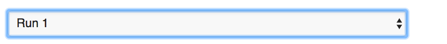<figcaption></figcaption></figure>

## URL Errors 

The **URL Errors** table shows any errors that have occurred for the page during the test.

<figure>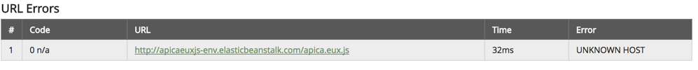<figcaption></figcaption></figure>

Each URL is displayed as a row in the table.

| **Column** | **Description**                          |
| ---------- | ---------------------------------------- |
| #          | ID number.                               |
| Code       | Error code, if any.                      |
| URL        | URL associated with the error.           |
| Time       | Time elapsed from the start of the test. |
| Error      | Error message.                           |

## Pages 

The **Pages** table(s) shows information about the page(s) in the test and the URLs called for each page during the test run.

<figure>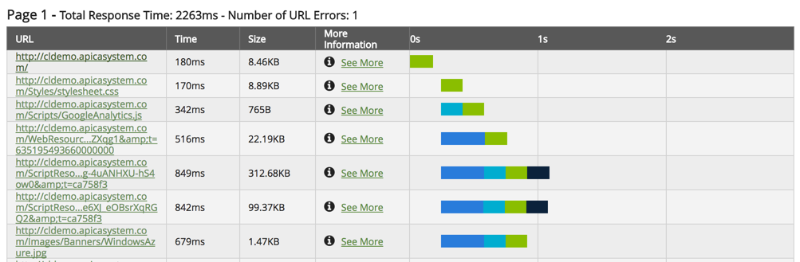<figcaption></figcaption></figure>

Each page is displayed in a table, with URLs displayed in rows:

| **Column**       | **Description**                                 | **Comment**                                                                                                                              |
| ---------------- | ----------------------------------------------- | ---------------------------------------------------------------------------------------------------------------------------------------- |
| URL              | Called URL.                                     |                                                                                                                                          |
| Time             | Time until received response.                   |                                                                                                                                          |
| Size             | Response size.                                  |                                                                                                                                          |
| More Information | Show more information about the URL.            | Click to see [more information](https://apica-kb.atlassian.net/wiki/spaces/ALTDOCS/pages/5672502/V+More+Information) about the response. |
|  0s, 1s, 2s….    | Graphical representation of the response times. |  Click to see [timing details](https://apica-kb.atlassian.net/wiki/spaces/ALTDOCS/pages/5672499/V+URL+Details).                          |

## The “More Information” Column 

More information about the response is available for each URL. To see more information about a particular URL, click the “See More” link. A popup containing details about the URL is shown:

<figure>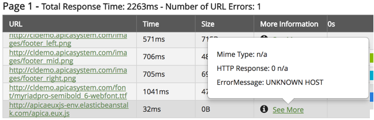<figcaption></figcaption></figure>

| **Item**      | **Description**                                                                                                                       |
| ------------- | ------------------------------------------------------------------------------------------------------------------------------------- |
| Mime Type     | [MIME Type](https://apica-kb.atlassian.net/wiki/pages/createpage.action?spaceKey=GLOS\&title=MIME%20Type) for the response message.   |
| HTTP Response | Response [HTTP Status Codes](https://apica-kb.atlassian.net/wiki/pages/createpage.action?spaceKey=GLOS\&title=HTTP%20Status%20Codes). |
| Error Message | Returned error message (if the URL is associated with an error).                                                                      |

## View Details 

To see the timing details about a particular URL:

* Click the **representation** for the desired URL

A popup containing details about the URL is shown:

<figure>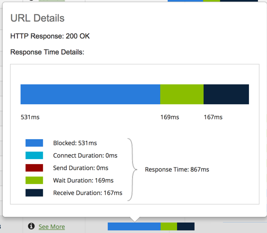<figcaption></figcaption></figure>

Information about the HTTP call is shown at the top.

| Item          | Description                                                                                                                           |
| ------------- | ------------------------------------------------------------------------------------------------------------------------------------- |
| HTTP Response | Response [HTTP Status Codes](https://apica-kb.atlassian.net/wiki/pages/createpage.action?spaceKey=GLOS\&title=HTTP%20Status%20Codes). |
| Error Message | Returned error message (if the URL is associated with an error).                                                                      |

The **Response Time Details** section shows a graphical representation of the flow and a legend with times.

| Item                                                                                                          | Description       |
| ------------------------------------------------------------------------------------------------------------- | ----------------- |
|  |  Blocked          |
| .png>)                                  |  Connect Duration |
|                                         |  Send Duration    |
|      |  Wait Duration    |
|                                         |  Receive Duration |

The Total **Response Time** is displayed as a summary of the detailed view.
