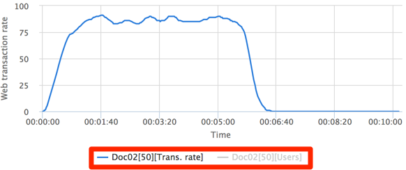
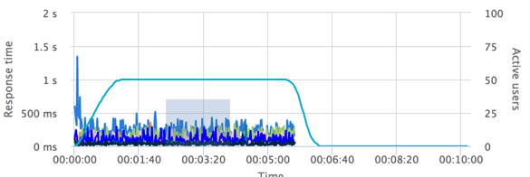
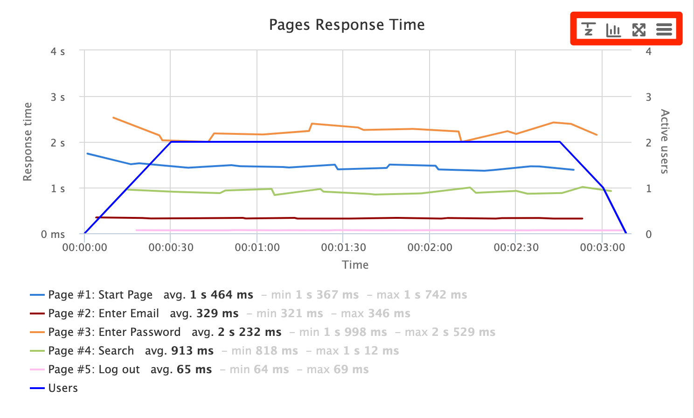

# Understanding Load Test Result Charts

A major component of the Result Details tab is the charts which display various metrics, such as measured Network Throughput and measured HTTP/S hits per second. It is possible to manipulate, print, and add metrics to these charts in order to gain a greater understanding of how the Load Test performed.

You can view details about points in the graph by pointing at them with the cursor:

You can hide a data source if more than one is present by clicking on the name of the data source below the chart:

You can zoom in on a specific section of the chart by clicking and dragging on the portion you would like to see in finer detail:

## Action Buttons 

All charts have a number of action buttons in their top right corner. The buttons available vary with chart type and contents.

| Icon                                         | Action             | Description                                                                                              |
| -------------------------------------------- | ------------------ | -------------------------------------------------------------------------------------------------------- |
|  | Chart Options\*    | The **Chart Options** button allows you to add metrics to display in the charts for comparison purposes. |
|  | Switch Time\*      | The **Switch Time** button changes the time mode for the chart                                           |
|  | Switch Chart Type  | The **Switch Chart Type** button changes the chart type between a bar graph and a line graph             |
|                                              | Switch Chart Size  | The **Switch Chart Size** button expands the chart to cover the full width of the browser                |
|                                              | Chart Context Menu | The **Chart Context Menu** button lets you print or download the chart in various image formats          |

\*These buttons are only displayed on certain graphs.

### Chart Options 

The Chart Options button opens a dialog which allows you to add metrics to display in the charts for comparison purposes. The exact available metrics vary with the chart contents. Third party integrations such as AppDynamics may provide additional tabs.

To add an additional metric to the chart you are viewing, click the Chart Options button. A sidebar will appear which will allow you to select a Project to pull a metric from:

Note that in the above instance, AppDynamics has been configured for the account, so an extra tab appears next to the “Test Result” tab. Clicking this tab will allow you to specify an AppDynamics server and application to use in order to provide AppDynamics-specific metrics. In order for AppDynamics metrics to appear under any test instances, the inclusion of AppDynamics metrics must have been specified when the load test was configured and started via the [New Test](broken-reference) page.

Find the instance in the tree and select the metrics to add to the chart:

If you want to add the metrics to all charts, mark the “Apply To All Charts” checkbox. Click “Compare” to add the metrics to the chart:

### Switch Time 

The Switch Time button changes the time mode for the chart:

Charts can have two time modes: **absolute** and **relative**. The absolute mode shows an absolute timestamp for the chart:

The relative mode shows time relative to the start of the test:

### Switch Chart Type 

The Switch Chart Type button changes the chart type between a line and a bar chart. The line chart shows a more continuous representation of the metric being defined, in this case the web transaction rate:

The bar chart places greater emphasis on individual data points collected during the test:

### Switch Chart Size 

The Switch Chart Size button expands the chart to cover the full width of the browser.

Expanded view:

### Chart Context Menu 

The Chart Context Menu allows you to print the chart or download the chart as a PNG, JPEG, PDF, or SVG:

